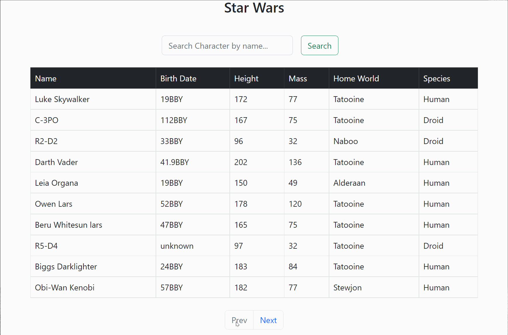

# **Star wars Api App**

 This application is built in **_React_**

 Live Version **_[here](https://expense-tracker-react-1.herokuapp.com/)_**

# **Summary**

- As a new developer, I had never built anything before requiring HTTP requests, so this project was unfamiliar to me. Additionally, fetching and understanding promises as well as using async functions were challenging at first. However, once I understood how to build this project, it was a lot of fun. The whole experience was a great learning opportunity.

- **Tools Used:**
  - Promise, Promise.all
  - Axios
  - Async functions
  - props
  - useState
  - useEffect
  - Custom Hooks
  - Functional Components
  - onClick EventListener

# Author

Komal | Software Developer | [Expense Tracker App](https://expense-tracker-react-1.herokuapp.com/) | [LinkedIn](https://www.linkedin.com/in/komalpreet-kaur-3b6924177/)
